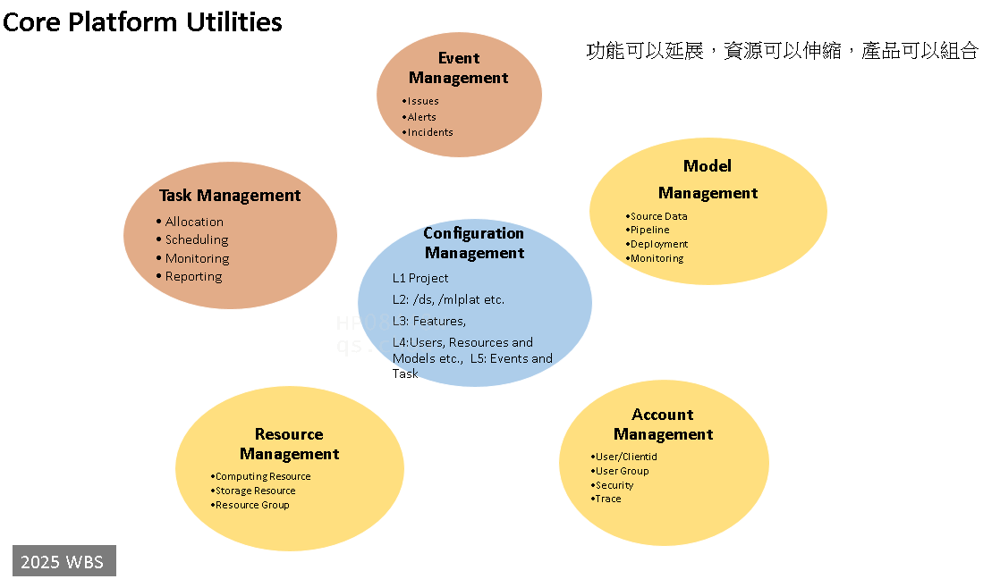

 # Core Data Plateform Utilities


There are two blue prints /account and /api at the host services.
## /account
data studio api account management allow user to create his/her owned client id to use services provided by data studio.
Also, admins use the same app to maintain privileges of those client ids.
## /api 
- /apikey Authorized by client id and password
- /user Authorized by ssotoken, will get the user's ad name by ssotoken
- /user/clients Authorized by ssotoken, will the client ids created by the user 
- /user/permits/client Authorized by ssotoken, will select a client that has the required permits, return None if there is not the client 
- /user/permits/client/apikey Authorized by ssotoken, will select a client that has the required permits, generate an apikey to represent the client
- /vapikey 
- /{client}/apikey Authorized by ssotoken

## app id is 'api_account'
the app id 'api_account' is used in the prefix of cookie's name and the prefix of redis key to user's ext info.
## os.environ
os.environ["api_account_env"] is 'prod'|'test' or else. 
- validate_user use this env to switch the 'prod'|'test' sso api from samv4 
os.environ['configpath'] is where the config.json reside
## development env
run the pack_intall_dpam after the change. It will install and pack the instalation file at the dist folder.
```bash
python -m pack_install_dpam
```

Run the server at the development environment
```bash
python -m dpam.account_portal
```


## testing env
Prequist: Case when finished development, and the installatiion file has generated. [installation file location](./dist/) 
- Copy the installation file onto the mount folder at innoloud (such as \\tncloudnas\datastudio-ci-dev-ds-ci-dev-ext-01$\test\dataapigrpc\account\dist)
- Needs to update the \\tncloudnas\datastudio-ci-dev-ds-ci-dev-ext-01$\test\dataapigrpc\account\init_dpam.sh to correct the installation file's version.
```bash
python -m pip install dist/dsbase-250325.164719-py3-none-any.whl
python -m pip install dist/dpam-250326.121909-py3-none-any.whl
gunicorn --bind 0.0.0.0:8080 dpam.account_portal:app --log-file /app/ext/gunicorn.log --timeout 900
```
- restart container after update