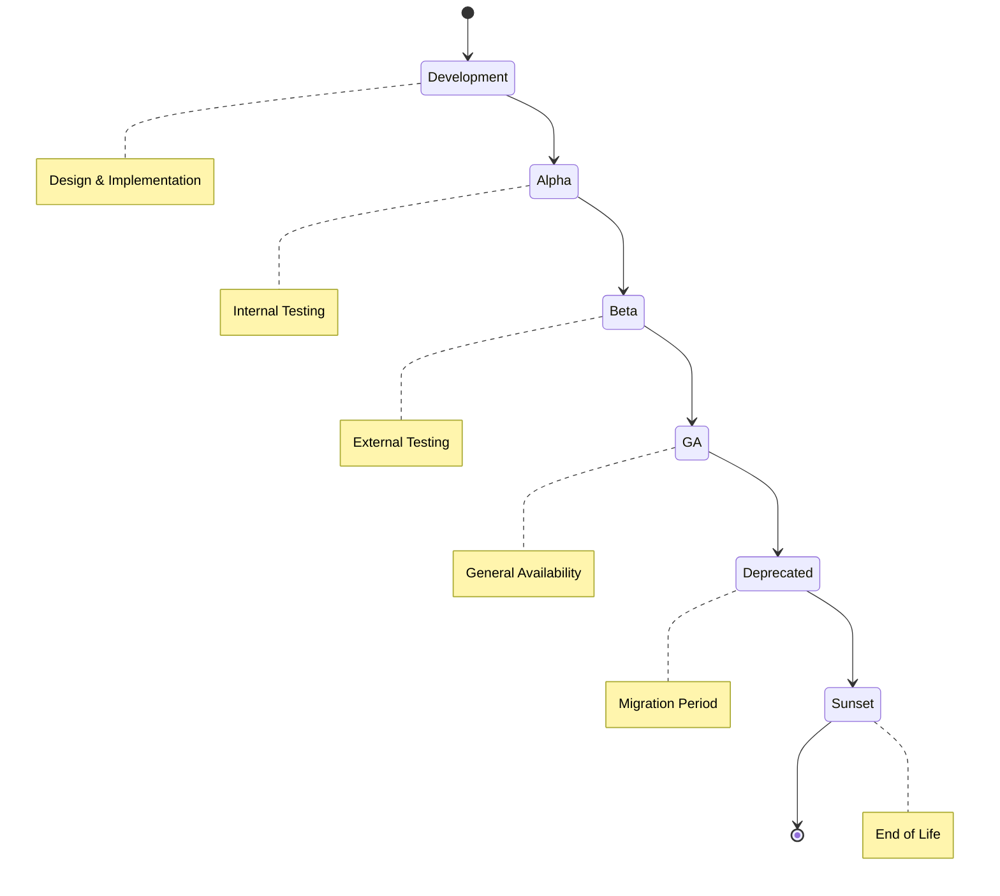

# API Versioning Operation Guide

## Table of Contents
- [1. Overview](#1-overview)
- [2. Goals and Objectives](#2-goals-and-objectives)
- [3. Roles and Responsibilities](#3-roles-and-responsibilities)
- [4. Architecture Overview](#4-architecture-overview)
- [5. How-To Guides](#5-how-to-guides)
- [6. Best Practices](#6-best-practices)
- [7. Troubleshooting](#7-troubleshooting)
- [8. Monitoring and Metrics](#8-monitoring-and-metrics)
- [9. Migration Strategies](#9-migration-strategies)
- [10. API Documentation](#10-api-documentation)

---

## 1. Overview

The API Versioning system in CDPU (Core Data Platform Utilities) provides a robust framework for managing multiple API versions simultaneously, ensuring backward compatibility while allowing for progressive enhancement and deprecation of older versions.

### Key Features
- **URL-based versioning** (`/api/v1`, `/api/v2`)
- **Automatic data transformation** between versions
- **Deprecation lifecycle management**
- **Client migration support**
- **Version-specific documentation**

### System Components
```
┌─────────────────────────────────────────────┐
│            API Gateway                      │
├─────────────────────────────────────────────┤
│         Version Manager                     │
│  ┌─────────┐ ┌─────────┐ ┌─────────┐        │
│  │   v1    │ │   v2    │ │   v3    │        │
│  └─────────┘ └─────────┘ └─────────┘        │
├─────────────────────────────────────────────┤
│         Transformation Layer                │
│  ┌─────────────────────────────────┐        │
│  │  v1↔v2   │  v2↔v3  │  v1↔v3     │        │
│  └─────────────────────────────────┘        │
└─────────────────────────────────────────────┘
```

---

## 2. Goals and Objectives

### Primary Goals

| Goal | Description | Success Criteria |
|------|-------------|------------------|
| **Backward Compatibility** | Maintain support for existing clients | Zero breaking changes for active versions |
| **Progressive Enhancement** | Introduce new features without disruption | New versions deployed without downtime |
| **Smooth Deprecation** | Gracefully phase out old versions | 100% client migration before sunset |
| **API Evolution** | Enable API improvements over time | Regular version releases (quarterly) |

### Business Objectives

- **Reduce Integration Costs**: Minimize client-side changes
- **Improve Developer Experience**: Clear versioning and migration paths
- **Maintain SLA Compliance**: No service disruption during transitions
- **Enable Innovation**: Deploy new features without legacy constraints

---

## 3. Roles and Responsibilities

### 3.1 API Product Owner

**Responsibilities:**
- Define versioning strategy and roadmap
- Approve new version releases
- Set deprecation timelines
- Communicate changes to stakeholders

**Key Activities:**
```markdown
- [ ] Review quarterly version planning
- [ ] Approve deprecation notices
- [ ] Sign off on sunset dates
- [ ] Stakeholder communication
```

### 3.2 API Developer

**Responsibilities:**
- Implement new API versions
- Create transformation rules
- Maintain backward compatibility
- Write version documentation

**Key Activities:**
```markdown
- [ ] Design API changes
- [ ] Implement version endpoints
- [ ] Create transformation logic
- [ ] Write migration guides
- [ ] Update API documentation
```

### 3.3 DevOps Engineer

**Responsibilities:**
- Deploy version updates
- Monitor version usage
- Manage version routing
- Handle version rollbacks

**Key Activities:**
```markdown
- [ ] Deploy new versions
- [ ] Configure load balancers
- [ ] Monitor performance metrics
- [ ] Manage version rollbacks
- [ ] Scale version-specific resources
```

### 3.4 API Consumer (Client Developer)

**Responsibilities:**
- Integrate with appropriate API version
- Plan migration to newer versions
- Test version compatibility
- Report version-related issues

**Key Activities:**
```markdown
- [ ] Select appropriate API version
- [ ] Implement version-specific code
- [ ] Test with new versions
- [ ] Plan migration timeline
- [ ] Update client applications
```

### RACI Matrix

| Activity | Product Owner | Developer | DevOps | Consumer |
|----------|--------------|-----------|---------|----------|
| Version Strategy | **R**esponsible | **C**onsulted | **I**nformed | **I**nformed |
| Implementation | **A**ccountable | **R**esponsible | **C**onsulted | **I**nformed |
| Deployment | **I**nformed | **C**onsulted | **R**esponsible | **I**nformed |
| Migration | **A**ccountable | **C**onsulted | **C**onsulted | **R**esponsible |
| Monitoring | **I**nformed | **C**onsulted | **R**esponsible | **I**nformed |

---

## 4. Architecture Overview

### 4.1 Version Lifecycle



### 4.2 Version Timeline

| Stage | Duration | Description |
|-------|----------|-------------|
| **Development** | 4-8 weeks | Design and implementation |
| **Alpha** | 2-4 weeks | Internal testing |
| **Beta** | 4-6 weeks | External testing with selected clients |
| **GA** | Minimum 12 months | Production use |
| **Deprecated** | 6 months | Migration period with warnings |
| **Sunset** | - | Version no longer available |

---

## 5. How-To Guides

### 5.1 Creating a New API Version

#### Step 1: Define Version Requirements

```python
# version_requirements.py
VERSION_SPEC = {
    'version': 'v3',
    'release_date': '2024-04-01',
    'changes': {
        'breaking': [
            'Renamed field: account_id -> accountIdentifier',
            'Changed response format for list endpoints'
        ],
        'new_features': [
            'Added pagination support',
            'Added filtering capabilities'
        ],
        'deprecations': [
            'Removed legacy authentication method'
        ]
    }
}
```

#### Step 2: Create Version Blueprint

```python
# src/dpam/api/v3/__init__.py
from flask import Blueprint, jsonify, request
from common.api.blueprints import create_versioned_blueprint

# Create v3 blueprint
dpam_v3 = create_versioned_blueprint('v3', 'dpam')

@dpam_v3.route('/accounts', methods=['GET'])
def get_accounts():
    """
    Get accounts with pagination and filtering
    
    Query Parameters:
        - page: Page number (default: 1)
        - per_page: Items per page (default: 20)
        - filter: Filter expression
    """
    page = request.args.get('page', 1, type=int)
    per_page = request.args.get('per_page', 20, type=int)
    filter_expr = request.args.get('filter', '')
    
    # Implementation with new features
    accounts = fetch_accounts_with_pagination(page, per_page, filter_expr)
    
    return jsonify({
        'data': accounts,
        'pagination': {
            'page': page,
            'perPage': per_page,
            'total': get_total_count(filter_expr)
        },
        'version': 'v3'
    })

@dpam_v3.route('/accounts/<account_identifier>', methods=['GET'])
def get_account(account_identifier):
    """Get single account with new field naming"""
    account = {
        'accountIdentifier': account_identifier,  # New field name
        'userIdentifier': 'USER001',
        'createdAt': '2024-01-01T10:00:00Z',
        'permissions': ['query', 'debug'],  # Lowercase
        'registries': ['/ds', '/ml'],
        'metadata': {
            'version': 'v3',
            'lastModified': '2024-01-15T14:30:00Z'
        }
    }
    return jsonify(account)
```

#### Step 3: Define Transformation Rules

```python
# src/common/api/transformers/v2_to_v3.py
from common.api.transformers import TransformationRule

def create_v2_to_v3_rule():
    """Create transformation rule from v2 to v3"""
    rule = TransformationRule()
    
    # Field renamings
    rule.rename_field('clientId', 'accountIdentifier')
    rule.rename_field('userId', 'userIdentifier')
    
    # Value transformations
    rule.transform_value('permission', 
        lambda x: [p.lower() for p in x] if isinstance(x, list) else [])
    
    rule.transform_value('registry',
        lambda x: x if x else [])
    
    # Add new metadata field
    rule.add_field('metadata', {
        'version': 'v3',
        'migrated': True
    })
    
    return rule

def create_v3_to_v2_rule():
    """Create transformation rule from v3 to v2"""
    rule = TransformationRule()
    
    # Reverse field renamings
    rule.rename_field('accountIdentifier', 'clientId')
    rule.rename_field('userIdentifier', 'userId')
    
    # Reverse value transformations
    rule.transform_value('permissions',
        lambda x: [p.upper() for p in x] if isinstance(x, list) else [])
    
    # Remove v3-specific fields
    rule.remove_field('metadata')
    rule.remove_field('pagination')
    
    return rule
```

#### Step 4: Register the Version

```python
# src/app.py
from common.api.versioning import APIVersionManager
from dpam.api.v3 import dpam_v3
from common.api.transformers.v2_to_v3 import (
    create_v2_to_v3_rule, 
    create_v3_to_v2_rule
)

def register_v3(app, version_manager):
    """Register v3 API version"""
    
    # Register version
    version_manager.register_version('v3', dpam_v3)
    
    # Register transformers
    transformer = VersionTransformer()
    transformer.rules[('v2', 'v3')] = create_v2_to_v3_rule()
    transformer.rules[('v3', 'v2')] = create_v3_to_v2_rule()
    
    version_manager.register_transformer(
        'v2', 'v3',
        lambda data: transformer.transform(data, 'v2', 'v3')
    )
    version_manager.register_transformer(
        'v3', 'v2',
        lambda data: transformer.transform(data, 'v3', 'v2')
    )
```

### 5.2 Deprecating an API Version

#### Step 1: Mark Version as Deprecated

```python
# src/app.py
def deprecate_v1(version_manager):
    """Deprecate v1 API version"""
    
    # Set deprecation with 180-day sunset period
    version_manager.register_version(
        'v1',
        dpam_v1,
        deprecated=True,
        sunset_days=180,
        successor='v2'
    )
    
    print(f"Version v1 deprecated. Sunset date: {sunset_date}")
```

#### Step 2: Add Deprecation Notice

```python
# src/common/api/deprecation.py
from datetime import datetime, timedelta

class DeprecationNotice:
    """Deprecation notice generator"""
    
    @staticmethod
    def generate_notice(version, sunset_date, successor):
        return {
            'deprecated': True,
            'version': version,
            'sunset_date': sunset_date.isoformat(),
            'successor': successor,
            'migration_guide': f'/docs/migration/{version}-to-{successor}',
            'message': (
                f"API version {version} is deprecated and will be "
                f"removed on {sunset_date.date()}. "
                f"Please migrate to {successor}."
            )
        }
    
    @staticmethod
    def add_to_response(response, notice):
        """Add deprecation headers to response"""
        response.headers['Deprecation'] = 'true'
        response.headers['Sunset'] = notice['sunset_date']
        response.headers['Link'] = (
            f'</api/{notice["successor"]}>; rel="successor-version", '
            f'<{notice["migration_guide"]}>; rel="deprecation"'
        )
        return response
```

#### Step 3: Notify Clients

```python
# scripts/notify_deprecation.py
import smtplib
from email.mime.text import MIMEText
from email.mime.multipart import MIMEMultipart

def notify_clients(version, sunset_date):
    """Send deprecation notice to all clients"""
    
    clients = get_clients_using_version(version)
    
    for client in clients:
        subject = f"Important: API {version} Deprecation Notice"
        
        body = f"""
        Dear {client['name']},
        
        We are writing to inform you that API {version} will be deprecated
        and removed on {sunset_date}.
        
        Action Required:
        - Migrate to the latest version (v2 or v3)
        - Review the migration guide: /docs/migration
        - Test your integration with the new version
        
        Timeline:
        - Deprecation announced: Today
        - Migration period: 180 days
        - Sunset date: {sunset_date}
        
        Please contact support if you need assistance.
        
        Best regards,
        API Team
        """
        
        send_email(client['email'], subject, body)
```

### 5.3 Monitoring Version Usage

#### Dashboard Metrics

```python
# src/monitoring/version_metrics.py
from prometheus_client import Counter, Histogram, Gauge

# Define metrics
version_requests = Counter(
    'api_requests_total',
    'Total API requests',
    ['version', 'endpoint', 'method']
)

version_latency = Histogram(
    'api_request_duration_seconds',
    'API request latency',
    ['version', 'endpoint']
)

active_versions = Gauge(
    'api_active_versions',
    'Number of active API versions'
)

deprecated_version_usage = Counter(
    'api_deprecated_requests_total',
    'Requests to deprecated versions',
    ['version']
)

def track_request(version, endpoint, method, duration):
    """Track API request metrics"""
    version_requests.labels(
        version=version,
        endpoint=endpoint,
        method=method
    ).inc()
    
    version_latency.labels(
        version=version,
        endpoint=endpoint
    ).observe(duration)
    
    if is_deprecated(version):
        deprecated_version_usage.labels(version=version).inc()
```

#### Usage Report

```python
# scripts/generate_usage_report.py
def generate_version_usage_report():
    """Generate version usage report"""
    
    report = {
        'generated_at': datetime.now().isoformat(),
        'versions': {}
    }
    
    for version in get_all_versions():
        stats = get_version_statistics(version)
        
        report['versions'][version] = {
            'status': stats['status'],
            'total_requests': stats['request_count'],
            'unique_clients': stats['unique_clients'],
            'avg_latency_ms': stats['avg_latency'],
            'error_rate': stats['error_rate'],
            'top_endpoints': stats['top_endpoints'][:5],
            'client_breakdown': stats['client_breakdown']
        }
    
    return report

# Generate weekly report
if __name__ == '__main__':
    report = generate_version_usage_report()
    save_report(report)
    send_report_email(report)
```

---

## 6. Best Practices

### 6.1 Version Design Principles

| Principle | Description | Example |
|-----------|-------------|---------|
| **Semantic Versioning** | Use clear version numbers | v1, v2, v3 (not v1.2.3) |
| **Minimal Breaking Changes** | Batch breaking changes | Group changes into major versions |
| **Backward Compatibility** | Maintain compatibility when possible | Add fields, don't remove |
| **Clear Documentation** | Document all changes | Changelog, migration guide |
| **Gradual Deprecation** | Provide adequate migration time | Minimum 6 months notice |

### 6.2 API Evolution Patterns

#### Pattern 1: Additive Changes (Non-Breaking)
```python
# v1 Response
{
    "id": "123",
    "name": "John"
}

# v2 Response (additive - backward compatible)
{
    "id": "123",
    "name": "John",
    "email": "john@example.com"  # New field added
}
```

#### Pattern 2: Field Renaming (Breaking)
```python
# Use transformation layer
transformer.rename_field('client_id', 'clientIdentifier')

# Provide both fields during transition
{
    "client_id": "123",        # Deprecated
    "clientIdentifier": "123"  # New field
}
```

#### Pattern 3: Format Changes (Breaking)
```python
# v1: String format
{
    "permissions": "READ|WRITE|DELETE"
}

# v2: Array format
{
    "permissions": ["READ", "WRITE", "DELETE"]
}
```

### 6.3 Migration Guidelines

#### For API Developers

```markdown
## Migration Checklist

### Pre-Release
- [ ] Document all breaking changes
- [ ] Create transformation rules
- [ ] Write migration guide
- [ ] Update API documentation
- [ ] Create example code

### Release
- [ ] Deploy new version
- [ ] Enable transformation layer
- [ ] Send notifications
- [ ] Update SDKs
- [ ] Monitor adoption

### Post-Release
- [ ] Track migration progress
- [ ] Address client issues
- [ ] Update documentation
- [ ] Plan deprecation timeline
```

#### For API Consumers

```markdown
## Client Migration Steps

1. **Review Changes**
   - Read migration guide
   - Identify affected endpoints
   - Review breaking changes

2. **Update Integration**
   - Update API version in config
   - Modify field mappings
   - Update error handling

3. **Test Thoroughly**
   - Test in staging environment
   - Verify data transformations
   - Check error scenarios

4. **Deploy Gradually**
   - Use feature flags
   - Monitor error rates
   - Rollback if needed
```

---

## 7. Troubleshooting

### 7.1 Common Issues

| Issue | Symptoms | Solution |
|-------|----------|----------|
| **Version Not Found** | 404 errors on valid endpoints | Check version registration, verify URL format |
| **Transformation Errors** | 500 errors, malformed responses | Review transformation rules, check null handling |
| **Deprecation Headers Missing** | No sunset headers | Verify deprecation configuration |
| **Performance Degradation** | Slow response times | Optimize transformation logic, add caching |
| **Client Migration Issues** | Integration failures | Provide detailed examples, enhance documentation |

### 7.2 Debugging Guide

#### Enable Debug Logging

```python
# config/logging.py
import logging

logging.basicConfig(
    level=logging.DEBUG,
    format='%(asctime)s - %(name)s - %(levelname)s - %(message)s'
)

# Enable version manager debugging
logging.getLogger('common.api.versioning').setLevel(logging.DEBUG)
logging.getLogger('common.api.transformers').setLevel(logging.DEBUG)
```

#### Version Diagnostics Endpoint

```python
@app.route('/api/diagnostics/versions')
def version_diagnostics():
    """Diagnostic endpoint for version information"""
    
    diagnostics = {
        'active_versions': list(version_manager.versions.keys()),
        'deprecated_versions': [
            v for v, info in version_manager.versions.items()
            if info.is_deprecated
        ],
        'transformers': [
            f"{v1}->{v2}" 
            for (v1, v2) in version_manager.transformers.keys()
        ],
        'current_time': datetime.now().isoformat(),
        'version_details': {}
    }
    
    for version, info in version_manager.versions.items():
        diagnostics['version_details'][version] = {
            'status': 'deprecated' if info.is_deprecated else 'active',
            'released': info.released.isoformat(),
            'deprecated_at': info.deprecated_at.isoformat() if info.deprecated_at else None,
            'sunset_at': info.sunset_at.isoformat() if info.sunset_at else None,
            'successor': info.successor
        }
    
    return jsonify(diagnostics)
```

---

## 8. Monitoring and Metrics

### 8.1 Key Performance Indicators (KPIs)

| Metric | Target | Alert Threshold | Description |
|--------|--------|-----------------|-------------|
| **Version Adoption Rate** | >80% on latest | <50% | % of requests to current version |
| **Migration Progress** | 100% before sunset | <75% at T-30 days | % of clients migrated |
| **Transformation Latency** | <10ms | >50ms | Time for version transformation |
| **Error Rate by Version** | <0.1% | >1% | Errors per version |
| **Deprecated Version Usage** | Decreasing | Increasing | Trend of deprecated usage |

### 8.2 Monitoring Dashboard

```yaml
# grafana/dashboard.yaml
dashboard:
  title: "API Version Monitoring"
  panels:
    - title: "Requests by Version"
      type: "graph"
      query: "sum(rate(api_requests_total[5m])) by (version)"
    
    - title: "Version Distribution"
      type: "pie"
      query: "sum(api_requests_total) by (version)"
    
    - title: "Deprecation Warning"
      type: "stat"
      query: "sum(api_deprecated_requests_total)"
    
    - title: "Transformation Latency"
      type: "heatmap"
      query: "histogram_quantile(0.95, api_transformation_duration)"
    
    - title: "Client Migration Status"
      type: "table"
      query: "api_client_version_usage"
```

### 8.3 Alerting Rules

```yaml
# prometheus/alerts.yaml
groups:
  - name: api_version_alerts
    rules:
      - alert: HighDeprecatedVersionUsage
        expr: |
          sum(rate(api_deprecated_requests_total[1h])) > 100
        for: 5m
        labels:
          severity: warning
        annotations:
          summary: "High usage of deprecated API version"
          description: "{{ $value }} requests/hour to deprecated versions"
      
      - alert: VersionTransformationSlow
        expr: |
          histogram_quantile(0.95, api_transformation_duration) > 0.05
        for: 10m
        labels:
          severity: warning
        annotations:
          summary: "Slow version transformation"
          description: "95th percentile transformation time is {{ $value }}s"
      
      - alert: ApproachingSunsetDate
        expr: |
          days_until_sunset < 30
        labels:
          severity: critical
        annotations:
          summary: "API version approaching sunset"
          description: "Version {{ $labels.version }} sunsets in {{ $value }} days"
```

---

## 9. Migration Strategies

### 9.1 Blue-Green Migration

```python
# migration/blue_green.py
class BlueGreenMigration:
    """Blue-green migration strategy"""
    
    def __init__(self, old_version, new_version):
        self.old_version = old_version
        self.new_version = new_version
        self.migration_percentage = 0
    
    def migrate_traffic(self, percentage):
        """Gradually migrate traffic to new version"""
        
        self.migration_percentage = percentage
        
        # Update load balancer weights
        update_load_balancer_weights({
            self.old_version: 100 - percentage,
            self.new_version: percentage
        })
        
        # Monitor metrics
        monitor_migration_metrics()
        
    def rollback(self):
        """Rollback to old version"""
        self.migrate_traffic(0)
        log_rollback_event()
```

### 9.2 Canary Deployment

```python
# migration/canary.py
class CanaryDeployment:
    """Canary deployment for new versions"""
    
    def deploy_canary(self, version, percentage=5):
        """Deploy to small percentage of users"""
        
        canary_users = select_canary_users(percentage)
        
        for user in canary_users:
            route_to_version(user, version)
        
        # Monitor canary metrics
        if monitor_canary_health():
            increase_canary_percentage()
        else:
            rollback_canary()
```

### 9.3 Client-Specific Migration

```python
# migration/client_migration.py
class ClientMigration:
    """Manage client-specific migrations"""
    
    def __init__(self):
        self.migration_schedule = {}
    
    def schedule_migration(self, client_id, target_version, date):
        """Schedule client migration"""
        
        self.migration_schedule[client_id] = {
            'target_version': target_version,
            'migration_date': date,
            'status': 'scheduled'
        }
    
    def execute_migration(self, client_id):
        """Execute client migration"""
        
        schedule = self.migration_schedule[client_id]
        
        # Update client configuration
        update_client_version(client_id, schedule['target_version'])
        
        # Verify migration
        if verify_client_migration(client_id):
            schedule['status'] = 'completed'
        else:
            schedule['status'] = 'failed'
            rollback_client(client_id)
```

---

## 10. API Documentation

### 10.1 Version-Specific Documentation

```python
# docs/generator.py
from flask import Blueprint, render_template

docs_bp = Blueprint('docs', __name__)

@docs_bp.route('/docs/<version>')
def version_docs(version):
    """Generate version-specific documentation"""
    
    return render_template('api_docs.html',
        version=version,
        endpoints=get_version_endpoints(version),
        changelog=get_version_changelog(version),
        examples=get_version_examples(version)
    )

@docs_bp.route('/docs/migration/<from_version>-to-<to_version>')
def migration_guide(from_version, to_version):
    """Generate migration guide"""
    
    changes = compare_versions(from_version, to_version)
    
    return render_template('migration_guide.html',
        from_version=from_version,
        to_version=to_version,
        breaking_changes=changes['breaking'],
        new_features=changes['features'],
        examples=get_migration_examples(from_version, to_version)
    )
```

### 10.2 OpenAPI Specification

```yaml
# openapi/v3.yaml
openapi: 3.0.3
info:
  title: CDPU API
  version: v3
  description: Core Data Platform Utilities API v3
  
servers:
  - url: https://api.cdpu.com/v3
    description: Production v3
  - url: https://api.cdpu.com/v2
    description: Production v2 (deprecated)
    
paths:
  /accounts:
    get:
      summary: List accounts
      parameters:
        - name: page
          in: query
          schema:
            type: integer
            default: 1
        - name: per_page
          in: query
          schema:
            type: integer
            default: 20
      responses:
        200:
          description: Success
          headers:
            API-Version:
              schema:
                type: string
                example: v3
            Deprecation:
              schema:
                type: string
                example: false
```

### 10.3 SDK Generation

```python
# sdk/generator.py
def generate_sdk(version, language):
    """Generate SDK for specific version and language"""
    
    if language == 'python':
        return generate_python_sdk(version)
    elif language == 'javascript':
        return generate_javascript_sdk(version)
    elif language == 'java':
        return generate_java_sdk(version)

def generate_python_sdk(version):
    """Generate Python SDK"""
    
    template = """
class CDPUClient:
    '''CDPU API Client for version {version}'''
    
    def __init__(self, api_key, version='{version}'):
        self.api_key = api_key
        self.version = version
        self.base_url = f'https://api.cdpu.com/{version}'
    
    def get_accounts(self, page=1, per_page=20):
        '''Get accounts with pagination'''
        return self._request('GET', '/accounts', 
            params={{'page': page, 'per_page': per_page}})
    """
    
    return template.format(version=version)
```

---

## Appendix A: Quick Reference

### Version Lifecycle Commands

```bash
# Create new version
python manage.py create-version v3

# Deprecate version
python manage.py deprecate-version v1 --successor v2 --sunset-days 180

# Check version status
python manage.py version-status

# Generate migration guide
python manage.py generate-migration v1 v2

# Monitor version usage
python manage.py version-metrics --version v1
```

### Configuration Files

```yaml
# config/versions.yaml
versions:
  v1:
    status: deprecated
    sunset_date: 2024-07-01
    successor: v2
  
  v2:
    status: active
    released: 2024-01-01
  
  v3:
    status: beta
    released: 2024-04-01
    ga_date: 2024-05-01
```

### Environment Variables

```bash
# .env
API_VERSION_DEFAULT=v2
API_VERSION_DEPRECATION_DAYS=180
API_VERSION_SUNSET_WARNING_DAYS=30
API_VERSION_TRANSFORMATION_CACHE_TTL=3600
API_VERSION_METRICS_ENABLED=true
```

---

## Appendix B: Templates

### Deprecation Notice Email Template

```html
<!-- templates/deprecation_notice.html -->
<!DOCTYPE html>
<html>
<head>
    <title>API Version Deprecation Notice</title>
</head>
<body>
    <h2>Important: API Version {{ version }} Deprecation</h2>
    
    <p>Dear {{ client_name }},</p>
    
    <p>This is to inform you that API version {{ version }} will be sunset on 
    <strong>{{ sunset_date }}</strong>.</p>
    
    <h3>Action Required:</h3>
    <ul>
        <li>Migrate to version {{ successor }} before {{ sunset_date }}</li>
        <li>Review the <a href="{{ migration_guide_url }}">migration guide</a></li>
        <li>Test your integration with the new version</li>
    </ul>
    
    <h3>Key Dates:</h3>
    <table>
        <tr>
            <td>Deprecation Announced:</td>
            <td>{{ deprecation_date }}</td>
        </tr>
        <tr>
            <td>Migration Deadline:</td>
            <td>{{ sunset_date }}</td>
        </tr>
    </table>
    
    <p>For assistance, contact our support team.</p>
    
    <p>Best regards,<br>API Team</p>
</body>
</html>
```

---

This comprehensive operation guide provides all the necessary information for managing API versioning in the CDPU system, from strategic planning to day-to-day operations and troubleshooting.