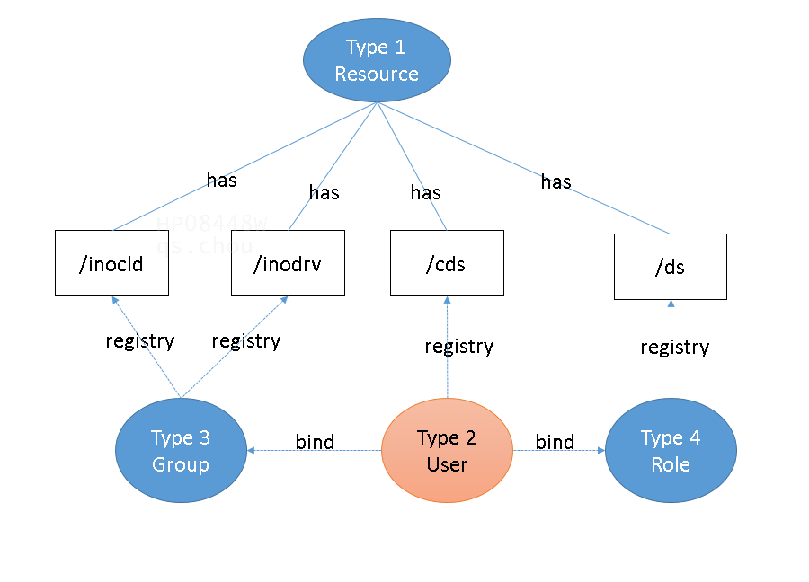

# account table

account table is used to defin account and its required resources includes application services and computation and storage services etc. Accounting required may indicates the resource needs authentication to know who is using the resource and authorization to check if the user has the right to use the resource.

Thus, it can be recognized as the master data of accounts with embedded relations with resources.


## client id and type



A client is assigned a type. There are 4 types defined as below table.

TYPE|DESC
--|--
1 | Resource
2 | User
3 | Group
4 | Role

- TYPE 1 Resource restricts the assigned clients are usually services such as an Application's api or cloud (innocloud) or storage services (innodrive).

- TYPE 2 User is created by general user (owner) and assigned the registry value by system's admins.

- TYPE 3 Group is a collection of type 1 resources and usually those kind of non-applicaion's api such as cloud and storage service. 

- Type 4 Role is a collection of type 1 resouces and usually those kind of application's api. 

- TYPE 2 User is allowed to bind with role and group to create relation with registried resources via group and role.

- Registry value of TYPE 1 is generally denote the sub path or domain of the client id if it is not empty.
- Registry value of TYPE 2, TYPE 3 & TYPE 4 

    - TYPE 2 (User) has registry value for accessing share data  
    - TYPE 3 (Group) has registry values for common pool resources such as innocloud  and innodrive.
    - TYPE 4 (Role) has registry values for assigning required functions to perform her/his jobs 

### Type 1 Resources example
- Basic types 
1. **/inocld** indidates innocloud resoruce has registry value such as /inocld/inx,/inocld/carux etc.
2. **/inodrv** indicates innodrive resource has registry value such as /inodrv/inx,/inodrv/carux etc.
3. **/ds** indicates default service has registry value such as /ml,/retrain,/carux
4. **/cds** indicates the client data store. If there is a client such as `eng` is to share its data, it must create a clien id with resource type 1 and registy value indicates its share scope.

- Registry values of Resource 
1. if the registry value contains non- `/*` values such as `/inx,/carux` in the `/inocld` case, it is the sub-type of the client id.  
2. if the registry value contains `/*`, it indicates the client id is the minimum  granularity needs to define. For example, `/inocld/inx/tst/datastudio-ci-dev` has registry value `/*` indicates it will incoperate all derived subdomains.
3. If the registry value is '*', it is usually auto-created by system means TBD. 
4. if the registry value is empty, it will usually mean the client id indicated resource cannot be deeper or it has been the endpoint. 
5. if the registry value contains both `/*` and non-`/*` values, the `/*` will be treated as a child client has its own definition. 
6. Follow above rule, the sample case `/ds/retrain` has registry value `/*,/cds`, thus it will derived a distinct client id named `/ds/retrain/*` and anther distinct client id `/ds/retrain/cds`. The `/ds/retrain/*` has registry value `-/ds/retrain/cds` to explicitly define the resource `/ds/retrain/*` must exclude `-/ds/retrain/cds`.

CLIENT_ID|TYPE|OWNER_USER_ID|REGISTRY|BIND_ROLE|BIND_GROUP
------|---------|-------|--------|-----------|--
/inocld|1|system|/inx,/carux||
/inocld/inx|1|system|/inocld/inx/prd,/inocld/inx/tst||
/inocld/inx/prd|1|system|/retrain||
/inocld/inx/prd/retrain|1|system|/*||
/inocld/inx/tst|1|system|/datastudio-ci-dev||
/inocld/inx/tst/datastudio-ci-dev|1|system|/*||
/inocld/carux/|1|system|/inocld/carux/prd,/inocld/carux/tst||
/inocld/carux/tst|1|system|/datastudio-ci-dev||
/inocld/carux/tst/datastudio-ci-dev|1|system|/*||
/inocld/carux/prd|1|system|/[TBD]||
/inodrv|1|system|/inx,/carux||
/inodrv/inx|1|system|/APDRV_DATASTUDIO||
/inodrv/inx/APDRV_DATASTUDIO|1|system|/*||
/inodrv/carux|1|system|/[TBD]||
/ds|1|system|/ml,/retrain,/carux||
/ds/ml|1|system|/class,/regression||
/ds/ml/class|1|system|/*||
/ds/ml/regression|1|system|/*||
/ds/retrain|1|system|/*,/cds ||
/ds/retrain/*|1|system|-/cds||(*1)
/ds/retrain/cds|1|system|/*||(*2)  
/ds/carux|1|system|/apds||
/ds/carux/apds|1|system|/*||
/cds/eng|1|system|/data_store/*||
/cds/apds|1|system|/data_store/dataservice/tnvpapds01_api/*||


(*1) Means `/ds/retrain/*` must exclude `/ds/
(*2) End with only `/*` indicates all sub domain or path are included

### Type 2 Users example (Typical Users)

CLIENT_ID|TYPE|OWNER_USER_ID|REGISTRY|BIND_ROLE|BIND_GROUP
------|---------|-------|--------|-----------|--
inx_retrain_user|2|system||retrain|inx
inx_retrain_cds_user|2|system||retrain_cds|inx
inx_ml|2|system||ml|inx
carux_pd_user|2|system||carux_apds|carux

### Type 3 & Type 4 Group and Role example

CLIENT_ID|TYPE|OWNER_USER_ID|REGISTRY|BIND_ROLE|BIND_GROUP
------|---------|-------|--------|-----------|--
inx|3|system|/inocld/inx,/inodrv/inx||
carux|3|system|/inocld/carux,/inodrv/carux||
retrain|4|system|/ds/retrain/*||
retrain_cds|4|system|/ds/retrain/cds||
ml|4|system|/ds/ml||
carux_apds|4|system|/ds/carux/apds||

## *Implementations*
###  Requirement: 
1. Members in the same department could see each other's data --> 
Share the client id  
Such as EE department in Carux PD (Only the user owns the client id can do data query from apds)
2.  Section manager could see her/his member's data --> assign the `/cds/$<member's clienid>` registry value in client id owned by the section mananger.
3. Assign a client's previledge from a typical user


***`Remark`***  Why seperating '/retain' and '/retrain/cds' as two kinds of service types? 

`/retrain` is a retrain service type alwayse followed by a named data serivce (with  )

`/retain/cds` is also a retrain service type, but different in there is not a fixed variants data service type.

`/nde` and `/retrain` are two kinds of service types in a broad categories. But `/nde` is alwayse implicit and omitted. Thus, a full name `/ds/retrain` will indicate it is a `/nde` + `/retrain` composited service types. The stress is the query conditions.

But `/retrain/cds` should be regarded as  `/retrain` is composited wit `/cds`.  The stress is on the mdlpack name of the trainning process.

## User's registry value
- An user's total registry value is the collection of it's own registry, bind role's and group's.
- Maintaining the registry value 
validating function - it is expected to exist the resouce id for each of the registry value, but also could be auto-created if not exist for below case:
- A `best matched resource` found, it can be created automatically
```python
from dpam.tools.account import Account
# Create an Account object for role type cliend

```
- What is `best matched resource` and why?
If a res has not a exactly matched client id for type 1, will try to find if existed  resources is best matched by pattern. The matched pattern must start with the leading domain such as `/ds/retrain`, `/ds/retrain/cds` etc.
For example, if a given res is `/ds/retrain/cds/abc`, both `/ds/retrain`, `/ds/retrain/cds` are pattern matched, but `/ds/retrain/cds` is selected as the best matched because it has the most matched number of domain, the system will create a new res by the given res id `/ds/retrain/cds/abc` and append the registry value for the best matched resource `/ds/retrain/cds`.
However, if there is not any best matched resource, the validating function will report invalid resource id and will not update.   

