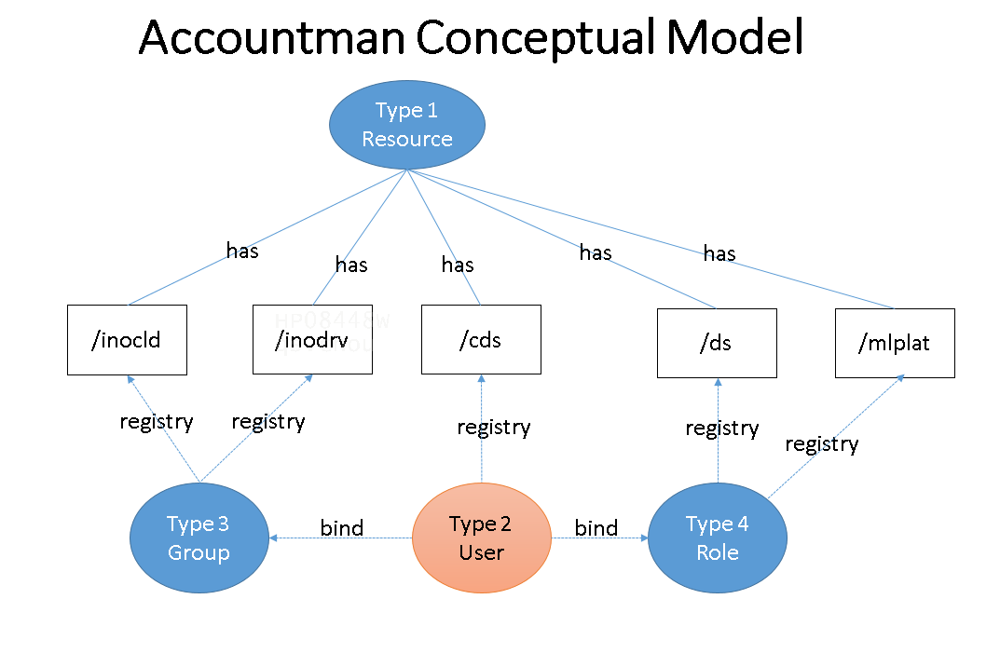

# Request Permit
Request permit is a function to `return permist or not` by checking if the passed registry value meets the requested resources by domain path format in general case.
## Account Management - Registry process and value
An user client's registry value is maintained by the platform administrator to keep a collection of resources defined in the account table that is allowed or forbiden for the user's client. 

The registry value is a string that can contains one to serveral resource ids seperated by ','.
If the string is a special character such as '*', it indicates the resource id is an endpoint.

### Maintaining rules of registry value
Below rules are applied on maintaining the user's registry value.
1. Check if exist the resource id. If exist, it will pass the check or do next step.
2. If not exist, check if existed the 'best match' resource id. The match resource is that has matched leading domain(s), the best match is the one has the most number of matched leading domain(s). If 'best match' exist, then the system will create the resource id and set it as an endpoint automatically. Also, the new created resource id will also be concatenated in the end of original registry value of found best matched resource.
3. If there is not 'best match' or it does not have any matched resource, it is not allowed to update the registry value.

### Consistency check and thumb of rules 

1.  Above rules ensures any element maintained in the registry value must existed in the resource id. If it is not the case, it should be reported error and is not allowed to maintain in the registry value.
2. A resource must be able to trace to its level 1 domain name. Thus, all resource ids must start with the domain names such as '/inocld', '/inodrv' and '/ds' etc. 
3. A reosurce is marked as an endpoint may be another resource's originator if it is selected as the 'best matched' resource.
4. If a resource id is end with '/*', it will need to check if containing the negative registry value. If it is, then the resource id in the negative registry should be excluded from all ('/*').

### Permit process and log 
A requsted resoruce is expressed in an `url format` with the requested user's registry value or client id.
1. Use the url to parse the path by urllib and get the domains of the path.
2. Use best match fuction to find the matched resource id
3. Check if the user's registry value contains the resoure id (positive or negative)
4. return permit or not permit

### Best match pattern matching logic
The `registry maintaining` and the `premit requesting` has the similar pattern matching logic  
`Registry maintaiing`: A given resource is to check if exist the same or best matched resource id in the resource table (account table where type =1)
`Reuest permit`:  A given resource is to check if exist the same or best matched resource id in the registry value.

